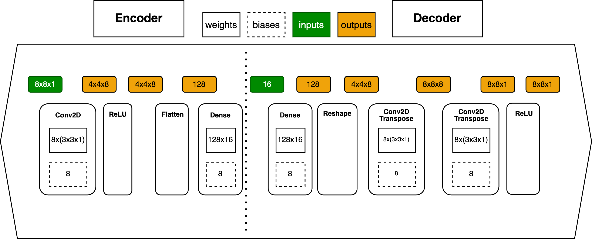

# Ecoder
Training ECON-T autoencoder model


This repo is based on the work done here https://github.com/cmantill/Ecoder which was accomplished using the original repo found here (https://github.com/kakwok/Ecoder).


## Setup

Local setup using miniconda3
```
source install_miniconda3.sh # if conda is not installed in your computer
source setup.sh # if you do not have the ecoder-env environment (i.e. if it is your first time)
conda activate ecoder-env
```

## Input data

Get data from Cernbox
```
mkdir data/nELinks_5
```
Download the data and place it in `data/nELinks_5`
cernbox: https://cernbox.cern.ch/index.php/s/YpAWu24aw6EaBk7

## Training ECON-T autoencoder
By default model, the autoencoder uses telescope loss, we can train the model as such:
### Train Float Point model
```
python3 train.py -i data/nElinks_5/  -o ./output/ --epoch 96 --AEonly 1 --nELinks 5 --noHeader --models 8x8_c8_S2_tele
```
### Train Quantized model
The quantized model uses the same loss function and has 5 bit weights (sign bit not included)
```
python3 train.py -i data/nElinks_5/  -o ./output/ --epoch 96 --AEonly 1 --nELinks 5 --noHeader --models 8x8_c8_S2_qK
```
CNN model with 8x8 arranged inputs, 3x3 kernel dimensions and 8 filters, and a stride size of 2x2, using the telescope function as a loss function.

The arguments are defined as:
- `-i data/nElinks_5/`: Input directory or input file. Here we have an example of the input training. In this case the .csv files are already shuffled and they do not contain headers. So the `--noHeader` option is needed.
- `-o ./output/`: Output directory. Here we have `output` as an example of the output directory. Change this to something more meaninful for future tests.
- `--epoch 96`: this represents the number of epochs to train the model. We usually train for ~100 epochs.
- `--AEonly`: is an argument to only evaluate the AutoEncoder algorithm (instead of also the other algorithms such as BSC,STC,Threshold..). This is usually an option that we want to include in this stage
- `--nElinks`: this is the number of active elinks for the input dataset (in this case 5 for the signal allocation algorithm.) Find more about the number of elinks and allocation [here](https://github.com/cmantill/ECONAutoencoderStudy/blob/master/fragments/README.MD#number-of-elinks).
- `--noHeader`: this argument is needed only for the shuffled dataset since it has no header. Other datasets (default `data/nElinks_5`) will contain headers.

Other possible arguments are:
- `--loss`: if there is a default loss function to use. We generalize want to use `telescopeMSE8x8` that is defined [here](https://github.com/fastmachinelearning/fastml-science/blob/master/telescope.py#L168-L170) and called [here](https://github.com/fastmachinelearning/fastml-science/blob/master/networks.py#L4). So we usually want to leave this argument empty.
- `--skipPlot`: Skip the plotting steps.
- `--full`: Run all the algorithms and metrics.
- `--quickTrain`: Train with only 5k events for testing purposes.
- `--retrain`: Re-train models even if weights are already present.
- `--evalOnly`: Use weights of already trained model to evaluate the performance of the network on the input sample.
- `--double`: Double the dataset by combining events from the input dataset.
- `--overrideInput`: Disable safety check on inputs
- `--nCSV`: Number of validation events to write to output .csv files.
- `--maxVal`: Clip outputs to maxVal
- `--rescaleInputToMax`: Rescale the input images so the maximum deposit is 1.
- `--rescaleOutputToMax`: Rescale the output images to match the initial sum of charge.
- `--nrowsPerFile`: Load only this number of rows per file
- `--occReweight`: Train with per-event weight on TC occupancy
- `--maskPartials`: Mask partial modules in the input files
- `--maskEnergies`: Mask input charges with energy fractions <= 0.05 (or some other value defined in train.py)
- `--saveEnergy`: save SimEnergy column from input data
- `--noHeader`: Input data has no header
- `--models`: Models to run.

The model parameters are defined as a dictionary in `networks.py`.
Other AE models can also be found in this module.

Other scripts in this repository are:
- denseCNN.py: where the Conv2D model is defined using keras and TF
- qdenseCNN.py: an equivalent version that uses qKeras
- get_flops.py: computes the number of flops (operations by a given network). Needs an model .json file as an input.
- telescope.py: computes the telescope metric that is used as a loss function
- ot_tf.py: for sinkhorn metric for qdenseCNN

Useful functions to plot, define or visualize metrics are defined in the `utils/` folder.

## Convert model to a TF graph

This is useful to evaluate the network with other data (e.g. for our physics studies).
The script uses tensorflow 2.4.0 and keras 2.2.4-tf (the versions can be found in CMSSW_11_1_0).
Can also be ran locally - just need to make sure versions are compatible.

```
### convert the decoder model
python3 converttoTF.py -o ./graphs/ -i <decoder_model_keras>.json --outputGraph decoder --outputLayer decoder_output/Sigmoid 
### convert the encoder model
python3 converttoTF.py -o ./graphs/ -i <encoder_model_keras>.json --outputGraph encoder --outputLayer encoded_vector/Relu 
```